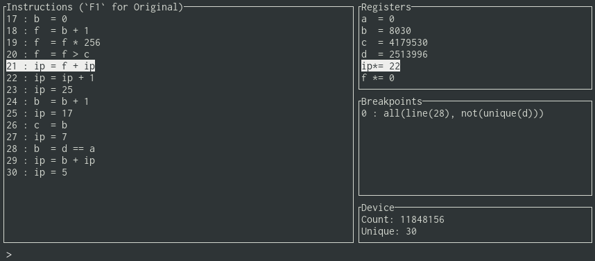

# ELFDB

Help save Christmas with ELFDB - the interactive debugger for [ELF code](https://adventofcode.com/2018/day/19).



To help future endeavours to save Christmas we need a better development environment.
This is part of that effort.

## Install

To run it you will need to install [`Rust`](https://rustup.rs).

After this is done, run this project with:

```
cargo run --release -- <path-to-input>
```

## Usage

elfdb is an interactive debugger, it will start up in a `paused` mode in which you can issue
commands.

There's a number of commands available, the most important of which are:

* `step` - to step a single instruction.
* `break` - to set breakpoints.
* `remove` - to remove breakpoints.
* `continue` - to continue running the program until a breakpoint is triggered or `p` is pressed
  to pause.

For a full overview of elfdb's capabilities, see the built-in `help` command.

#### Breakpoints

Breakpoints are set using a simple expression language.

Breakpoints are set using the `break <expr>` command, where `<expr>` is a breakpoint expression.

`<expr>` can be one of:

* `line(<line>)` - break if the debugger evaluates a given line.
* `read(<reg>)` - break when the program reads from register `<reg>`.
* `write(<reg>)` - break when the program writes to register `<reg>`.
* `not(<expr>)` - break when the expression `<expr>` is not true.
* `all(<expr1>[, <expr2>])` - break when all sub-expressions are true.
* `unique(<reg>)` - break when we see a new unique value in register `<reg>`.
* `<op>(<reg>, <value>)` - break when the given operation holds true.
  `<op>` can be one of: `eq`, `lt`, `lte`, `gt`, or `gte`.

A couple of example expressions are:

Break on line 28:

```
break line(28)
```

Break when the program reads from the register `a`:

```
break read(a)
```

Break on line 28 when the program reads from register `d`:

```
break all(line(28), read(d))
```

Break on line 28 when we see a value that is not unique in register `d`.

```
break all(line(28), not(unique(d)))
```
